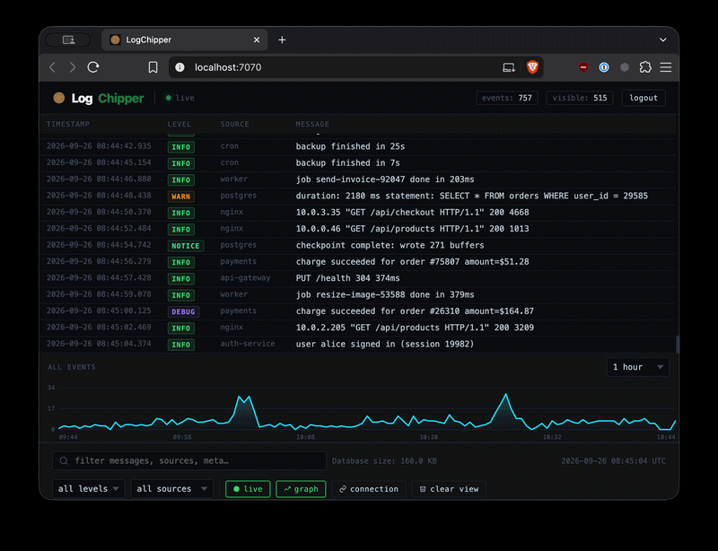

# LogChipper

A self-hosted log collector and viewer. Send logs over syslog or HTTP, then search and live-tail them in the browser. Single binary, SQLite storage.

<p align="center">
  
</p>

## Quick start

Using the [`docker-compose.yml`](docker-compose.yml) in this repo:

```bash
docker compose up -d
```

Open http://localhost:7070. By default the ports only listen on `127.0.0.1`; see [Network access](#network-access) to accept logs from other machines. The image, `ghcr.io/patricksocha/logchipper`, is built for amd64 and arm64. To build it yourself: `docker build -t logchipper .`

## Sending logs

**Syslog** (UDP or TCP, port 514):

```bash
logger -n localhost -P 514 "hello"
```

**HTTP:**

```bash
curl -X POST http://localhost:7070/api/logs \
  -H 'Content-Type: application/json' \
  -d '{"source":"my-app","level":"info","message":"hello"}'
```

Levels: `debug`, `info`, `notice`, `warn`, `error`. For plain text, `POST /api/logs/text` with `X-Source` and `X-Level` headers.

## Configuration

Set via environment variables (see `docker-compose.yml`) or flags (`logchipper -h`).

| Variable         | Default   | Description                                                     |
|------------------|-----------|-----------------------------------------------------------------|
| `AUTH`           | `true`    | Require a login. The first visit asks you to create the account |
| `ACCESS_MODE`    | `network` | Who can connect: `local`, `network` (LAN) or `internet`         |
| `ALLOWED_IPS`    |           | Extra IPs/CIDRs to allow. With `internet`, *only* these         |
| `INGEST_TOKEN`   |           | Require `Authorization: Bearer <token>` for HTTP ingest         |
| `RETENTION_DAYS` | `30`      | Delete logs older than this                                     |
| `SYSLOG_ENABLE`  | `true`    | Listen for syslog                                               |
| `PORT`           | `7070`    | HTTP UI port                                                       |

Size and connection limits are also configurable; run `logchipper -h` for the full list.

## Network access

The compose file binds its ports to `127.0.0.1`, so only the host itself can connect. To accept logs from your LAN or VPC, set `BIND_IP` to the host's private IP in a `.env` file next to `docker-compose.yml`:

```bash
BIND_IP=10.0.0.2
```

Why bind to an IP rather than rely on `ACCESS_MODE`:

- Docker publishes ports with its own iptables rules, which bypass ufw/firewalld.
- Behind Docker Desktop or Docker's userland proxy (e.g. IPv6 traffic), every client appears to come from a private gateway IP, so `ACCESS_MODE=network` lets everyone in.

`ACCESS_MODE` and `ALLOWED_IPS` are still useful as a second layer. To allow only your VPC, use `ACCESS_MODE=internet` with `ALLOWED_IPS=10.0.0.0/16`.

On AWS, GCP and Azure the public IP is NATed to the private one, so binding to the private IP isn't enough: restrict ports 7070 and 514 in the security group/firewall too. On Hetzner Cloud, the private network is a separate interface, so binding to its IP keeps the ports off the internet.

## Security

- Syslog has no authentication. Keep it on a private network, or set `SYSLOG_ENABLE=false` and use HTTP with `INGEST_TOKEN`.
- Create the account as soon as you first start it: until then, anyone who can reach the UI can claim it. Set `AUTH=false` to turn login off.
- Forgot the password? Stop the server, run `sqlite3 logchipper.db "DELETE FROM users"`, and set it up again.

## License

Copyright (C) 2026 Patrick Socha. Licensed under the [AGPL-3.0](LICENSE).
